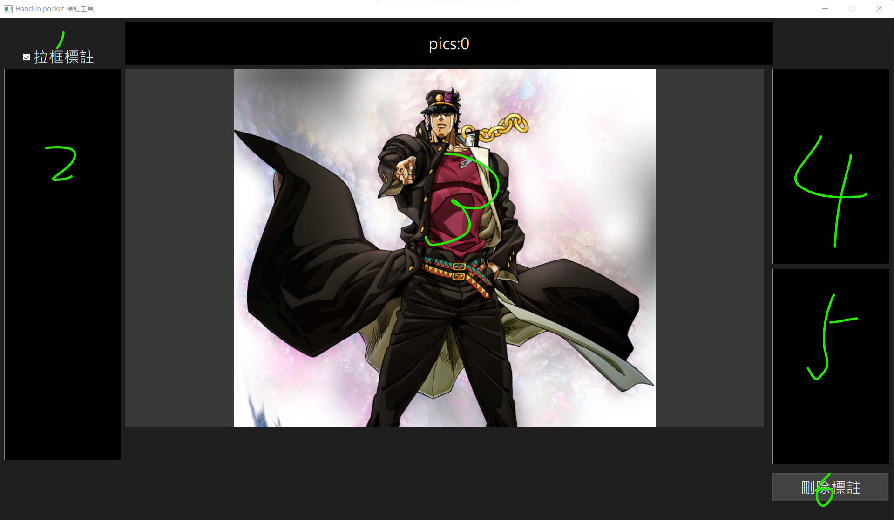

# two_class_labeler
## 操作流程

1.  手動建立 data 資料夾或開啟程式自動建立資料夾
2.  將照片放入 data
3.  開啟程式開始操作標註
4.  標註結果將存於 train_data 資料夾

## 操作說明

1.  若照片為整張需要裁切則打勾
2.  照片列表，點選照片將讀取到畫面3
3.  標註區域，若要裁切則直接於畫面中用左鍵或右鍵拖曳拉框標註，左右鍵將視為兩個不同的 class 分開儲存，若不裁切則直接點擊左右鍵分類
4.  以左鍵標註圖片將存於此，可以點擊瀏覽標註內容
5.  同上，以右鍵標註的 (ry
6.  瀏覽標註內容時可以刪除該標註